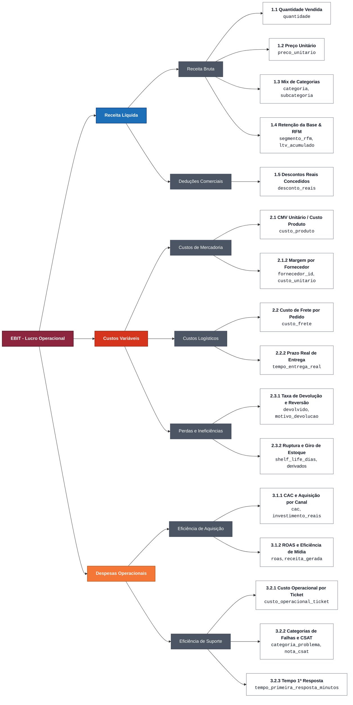

# Árvore de Hipóteses

## Questão Central

> **Onde está concentrada a perda de rentabilidade e eficiência da Vértice Retail, e qual plano de priorização maximiza o valor recuperável no horizonte de 90 dias?**

**Frentes da Árvore:**
- Receita Líquida
- Custos Variáveis
- Despesas Operacionais

---

## Diagrama da Árvore de Valor (Mermaid)

---

## Estrutura e Detalhe dos Indicadores

### EBIT (Lucro Operacional)
*Raiz da árvore · decomposto nas 3 frentes financeiras abaixo*

---

### Receita Líquida

#### Receita Bruta

##### Teste 1.1 · Quantidade Vendida
- **Colunas da base de dados**: `quantidade`
- **Hipótese afirmativa**: O crescimento de receita pode estar sendo puxado por volume, sem ganho real de ticket, indicando dependência de promoções ou migração de mix para itens de menor valor.
- **O que investigar / testes**: Evolução da quantidade vendida por categoria, canal e período; decomposição da variação de receita bruta em efeito volume vs. efeito preço.
- **Objetivo executivo**: Definir se o crescimento é sustentável (via preço/mix) ou dependente de volume bruto, para orientar a política comercial dos próximos 90 dias.

##### Teste 1.2 · Preço Unitário
- **Colunas da base de dados**: `preco_unitario`
- **Hipótese afirmativa**: O preço unitário pode estar estagnado ou caindo em categorias específicas, comprimindo receita bruta independentemente do desconto aplicado.
- **O que investigar / testes**: Preço unitário médio por categoria/produto ao longo do tempo; dispersão de preço dentro da mesma categoria.
- **Objetivo executivo**: Identificar categorias com erosão de preço para decidir onde revisar a política de precificação.

##### Teste 1.3 · Mix de Categorias e Subcategorias
- **Colunas da base de dados**: `categoria`, `subcategoria`, `produto`
- **Hipótese afirmativa**: A receita bruta e o ticket médio podem estar sendo puxados para baixo pela migração de vendas para categorias ou subcategorias de menor valor e margem.
- **O que investigar / testes**: Participação de cada categoria e subcategoria no total faturado; evolução do ticket médio e margem por departamento.
- **Objetivo executivo**: Reorganizar o catálogo e as vitrines de destaque para incentivar compras de maior valor agregado e margem.

##### Teste 1.4 · Retenção da Base & Segmentação RFM
- **Colunas da base de dados**: `segmento_rfm`, `ltv_acumulado`, `nivel_fidelidade`, `total_pedidos_historico`
- **Hipótese afirmativa**: Clientes fiéis e de alto valor (*Campeões* e *Fiéis*) podem estar reduzindo a frequência de compra e entrando em risco de churn silencioso sem ações de retenção.
- **O que investigar / testes**: Distribuição de receita e LTV acumulado por segmento RFM; taxa de recompra anual e migração entre clusters.
- **Objetivo executivo**: Criar réguas automáticas de CRM para reativar clientes de alto valor antes do abandono definitivo.

#### Deduções Comerciais

##### Teste 1.5 · Descontos Reais Concedidos
- **Colunas da base de dados**: `desconto_reais`
- **Hipótese afirmativa**: Descontos mais agressivos podem estar reduzindo a contribuição gerada por pedido (hipótese “Margem” do case).
- **O que investigar / testes**: Desconto médio (R$ e % implícito) por canal, categoria e campanha; correlação entre intensidade de desconto e margem de contribuição.
- **Objetivo executivo**: Quantificar quanto da receita bruta é cedida em desconto e recomendar tetos por canal/categoria.

---

### Custos Variáveis

#### Custos de Mercadoria

##### Teste 2.1 · CMV Unitário / Custo do Produto
- **Colunas da base de dados**: `custo_produto`
- **Hipótese afirmativa**: O custo de mercadoria vendida pode estar subindo mais rápido que o preço em parte do mix, comprimindo margem mesmo sem desconto.
- **O que investigar / testes**: Evolução de custo_produto vs. preco_unitario por SKU/categoria; produtos com menor margem de contribuição estrutural.
- **Objetivo executivo**: Priorizar SKUs/categorias onde a margem já nasce comprimida, antes de qualquer efeito de desconto ou frete.

##### Teste 2.1.2 · Margem por Fornecedor
- **Colunas da base de dados**: `fornecedor_id`, `custo_unitario` (cruzado com vendas)
- **Hipótese afirmativa**: Certos fornecedores concentram custos de compra elevados, deixando um spread comercial muito estreito antes do frete e despesas.
- **O que investigar / testes**: Curva ABC de fornecedores por volume faturado e margem bruta média gerada.
- **Objetivo executivo**: Renegociar tabela de custos e condições com os fornecedores críticos de menor spread.

#### Custos Logísticos

##### Teste 2.2 · Custo de Frete por Pedido
- **Colunas da base de dados**: `custo_frete`
- **Hipótese afirmativa**: O frete pode estar consumindo margem desproporcionalmente em pedidos pequenos ou em regiões específicas.
- **O que investigar / testes**: Custo de frete médio por pedido, por região e faixa de ticket; relação entre frete e margem de contribuição final.
- **Objetivo executivo**: Avaliar necessidade de frete mínimo, subsídio por faixa de ticket ou renegociação logística por região.

##### Teste 2.2.2 · Prazo Real de Entrega (SLA Logístico)
- **Colunas da base de dados**: `tempo_entrega_real`
- **Hipótese afirmativa**: Prazos de entrega longos e atrasos recorrentes aumentam diretamente a abertura de reclamações no suporte e as devoluções de pedidos.
- **O que investigar / testes**: Prazo médio real de entrega por estado e correlação com chamados de suporte sobre atraso logístico.
- **Objetivo executivo**: Identificar rotas críticas para renegociação de prazos com transportadoras e envio preventivo de alertas de rastreio.

#### Perdas e Ineficiências

##### Teste 2.3.1 · Taxa de Devolução e Reversão
- **Colunas da base de dados**: `devolvido`, `motivo_devolucao`
- **Hipótese afirmativa**: Rupturas, atrasos ou problemas de qualidade podem estar gerando devoluções que destroem valor após a venda (hipótese “Operações” do case).
- **O que investigar / testes**: Taxa de devolução por categoria/produto/canal; distribuição dos motivos de devolução; custo de reversão embutido.
- **Objetivo executivo**: Dimensionar o custo financeiro da devolução por causa-raiz e priorizar correções com maior potencial de recuperação de margem.

##### Teste 2.3.2 · Ruptura e Giro de Estoque
- **Colunas da base de dados**: `shelf_life_dias`
- **Colunas derivadas**: `ruptura (derivado)`, `giro (derivado)`
- **Nota**: “ruptura” e “giro” não existem como colunas nas bases, pois são métricas derivadas cruzando estoque × vendas. O HTML do case sugeria-as como se fossem campos diretos.
- **Hipótese afirmativa**: SKUs com giro baixo ou ruptura recorrente podem estar gerando, nos dois extremos, perda de venda (estoque zerado) e custo de capital parado (giro lento).
- **O que investigar / testes**: Frequência em que estoque_disponivel < ponto_pedido (proxy de ruptura, calculado); giro estimado cruzando saída em vendas com estoque médio; SKUs com shelf_life_dias curto e giro lento.
- **Objetivo executivo**: Priorizar SKUs para ação de reposição ou descontinuação com base em risco de ruptura e capital parado.

---

### Despesas Operacionais

#### Eficiência de Aquisição

##### Teste 3.1.1 · CAC e Aquisição por Canal
- **Colunas da base de dados**: `cac`, `investimento_reais`
- **Hipótese afirmativa**: Nem todo canal que traz volume de aquisição traz clientes igualmente rentáveis, já que alguns podem ter CAC elevado sem contrapartida de margem (hipótese “Marketing” do case).
- **O que investigar / testes**: CAC por canal e campanha ao longo do tempo; investimento_reais por canal vs. participação na receita gerada.
- **Objetivo executivo**: Recomendar realocação de verba de marketing entre canais com base em CAC, não apenas em volume de conversão.

##### Teste 3.1.2 · ROAS e Eficiência de Mídia
- **Colunas da base de dados**: `roas`, `receita_gerada`
- **Hipótese afirmativa**: Campanhas com ROAS aparentemente bom podem estar atribuindo receita de forma otimista, mascarando canais com retorno real mais fraco.
- **O que investigar / testes**: ROAS por canal/campanha; consistência entre receita_gerada (atribuída) e o modelo de atribuição declarado na base (*Last Click*, *First Click*, *Linear*).
- **Objetivo executivo**: Validar quais canais realmente sustentam retorno sobre mídia e quais dependem de atribuição favorável.

#### Eficiência de Suporte

##### Teste 3.2.1 · Custo Operacional por Ticket
- **Colunas da base de dados**: `custo_operacional_ticket`
- **Hipótese afirmativa**: O atendimento pode estar concentrando sintomas de problemas recorrentes, com custo operacional alto por ticket evitável (hipótese “Atendimento” do case).
- **O que investigar / testes**: Custo médio por ticket por categoria_problema e canal_entrada; participação de tickets de alto custo no total.
- **Objetivo executivo**: Estimar o ganho de produtividade e a redução de custo com automação de triagem nos temas mais frequentes.

##### Teste 3.2.2 · Categorias de Falhas Operacionais e CSAT
- **Colunas da base de dados**: `categoria_problema`, `nota_csat`, `texto_cliente`
- **Hipótese afirmativa**: Certas categorias de problema concentram alto volume e baixa satisfação ao mesmo tempo, sinalizando causas-raiz operacionais fora do atendimento em si que podem ser aprofundadas pelos relatos abertos dos clientes.
- **O que investigar / testes**: Distribuição de categoria_problema por volume e nota_csat média; mineração textual dos relatos livres (`texto_cliente`) via PLN para mapear causas-raiz não rotuladas nas categorias fechadas; cruzamento com tempo de resposta.
- **Objetivo executivo**: Mapear causas-raiz que, corrigidas na operação, reduzem volume de tickets e elevam satisfação simultaneamente.

##### Teste 3.2.3 · Tempo de Primeira Resposta
- **Colunas da base de dados**: `tempo_primeira_resposta_minutos`
- **Hipótese afirmativa**: Prazos longos de resposta degradam diretamente a nota de satisfação (CSAT) e provocam abertura de chamados duplicados.
- **O que investigar / testes**: Correlação entre tempo de espera até o primeiro retorno e nota de CSAT por canal de suporte.
- **Objetivo executivo**: Criar triagem rápida e fila prioritária para tickets com espera prolongada.

---

## 01 · Racional financeiro

### Por que ROIC, e por que começar pelo EBIT

**ROIC (Retorno sobre o Capital Investido)** é a métrica que liga o desempenho operacional à criação de valor econômico: mede quanto lucro operacional depois de impostos a empresa gera para cada real de capital empregado no negócio.

$$\text{ROIC} = \text{NOPAT} \div \text{Capital Investido}$$
$$\text{NOPAT} = \text{EBIT} \times (1 - \text{alíquota efetiva de imposto})$$

Um ROIC acima do custo de capital (WACC) indica criação de valor; abaixo, destruição de valor, mesmo com receita crescendo, como no caso da Vértice.

**Por que a árvore parte do EBIT e não do Capital Investido?** No horizonte de 90 dias definido pelo case, as alavancas acionáveis estão concentradas na operação (no P&L/DRE): preço, desconto, custo de mercadoria, frete, devolução, CAC, ROAS, custo de atendimento. Otimizar o Capital Investido (CAPEX, ativos imobilizados, estrutura de dívida) exige decisões estruturais e janelas de tempo maiores que não cabem no escopo deste case. Isso é uma escolha de escopo declarada, não uma limitação escondida: o ROIC continua sendo a métrica de referência de valor, mas a intervenção de 90 dias atua no numerador (NOPAT via EBIT), não no denominador.

---

## 02 · Rigor metodológico

### MECE: o que a estrutura garante e o que ainda precisa ser validado

**MECE** (Mutually Exclusive, Collectively Exhaustive) significa que as categorias de uma estrutura não se sobrepõem entre si (mutuamente exclusivas) e, somadas, cobrem o problema por inteiro (coletivamente exaustivas).

#### Mutuamente exclusivo
Cada real da DRE é contado uma única vez: fronteiras rígidas entre formação de receita (Raiz 1), custo direto da venda (Raiz 2) e despesa operacional (Raiz 3). Nenhum dos testes reaparece em mais de uma raiz.

> **Ponto em aberto:** a base de vendas traz `receita_liquida` e `devolvido` como colunas separadas. Ainda não sabemos, sem olhar os dados, se receita_liquida já desconta os pedidos devolvidos; se não descontar, o teste 2.3.1 (devolução, em Custos) e a Raiz 1 (Receita) podem estar tocando o mesmo real por ângulos diferentes. Precisa ser validado na primeira análise quantitativa.

#### Coletivamente exaustivo
As 3 raízes somadas reconstroem 100% da equação EBIT = Receita Líquida − Custos Variáveis − Despesas Operacionais, e a inclusão dos testes de Clientes (RFM/LTV) e Prazos de Entrega garante cobertura de 100% das 5 bases transacionais.

---

## 03 · Matriz de cobertura

### Árvore de valor × frentes de investigação do case

| Frente do case | Status | Testes na árvore | Observação |
| :--- | :---: | :---: | :--- |
| **Margem** | **Coberto** | `1.2, 1.3, 1.5, 2.1, 2.1.2, 2.2, 2.3.1` | Coberta em todas as camadas: preço, mix, desconto, CMV estrutural, fornecedores, frete e devoluções. |
| **Marketing** | **Coberto** | `3.1.1, 3.1.2` | Coberta por CAC unitário, ROAS e consistência dos modelos de atribuição (*Last*, *First*, *Linear*). |
| **Operações** | **Coberto** | `2.2.2, 2.3.1, 2.3.2` | Coberta por lead time real de entrega, taxa de devolução e risco de ruptura vs. giro de estoque. |
| **Atendimento** | **Coberto** | `3.2.1, 3.2.2, 3.2.3` | Coberta por custo por ticket, categorias de falha com CSAT (aprofundadas por PLN no texto do cliente) e tempo de 1ª resposta. |
| **Cliente** | **Coberto** | `1.4` | Coberta por segmentação RFM, clientes em risco de churn e análise de LTV acumulado. |
| **Gestão & Produtividade** | **Habilitador de Solução** | *Business Case* | Posicionada como pilar transversal de automação e IA aplicada na fase de soluções e iniciativas de 90 dias. |
